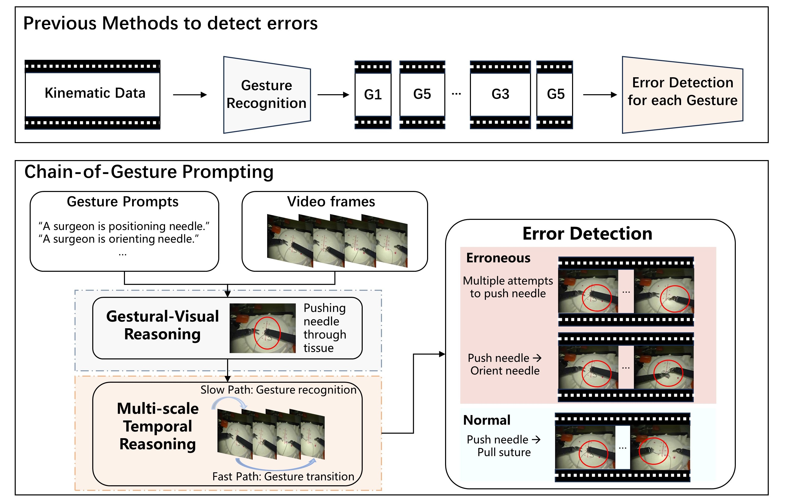
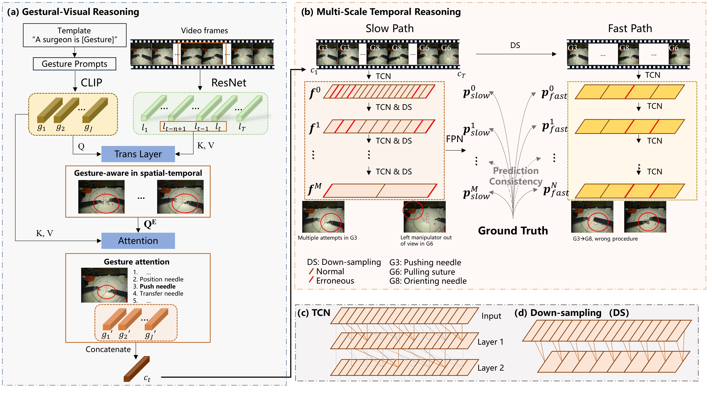
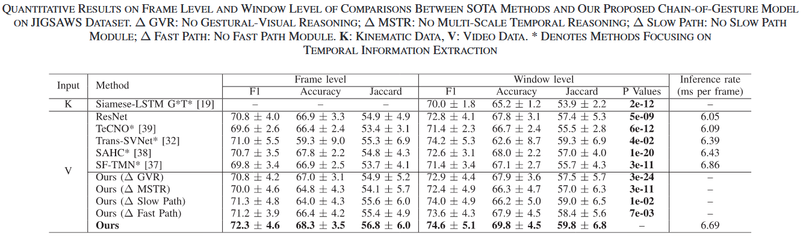
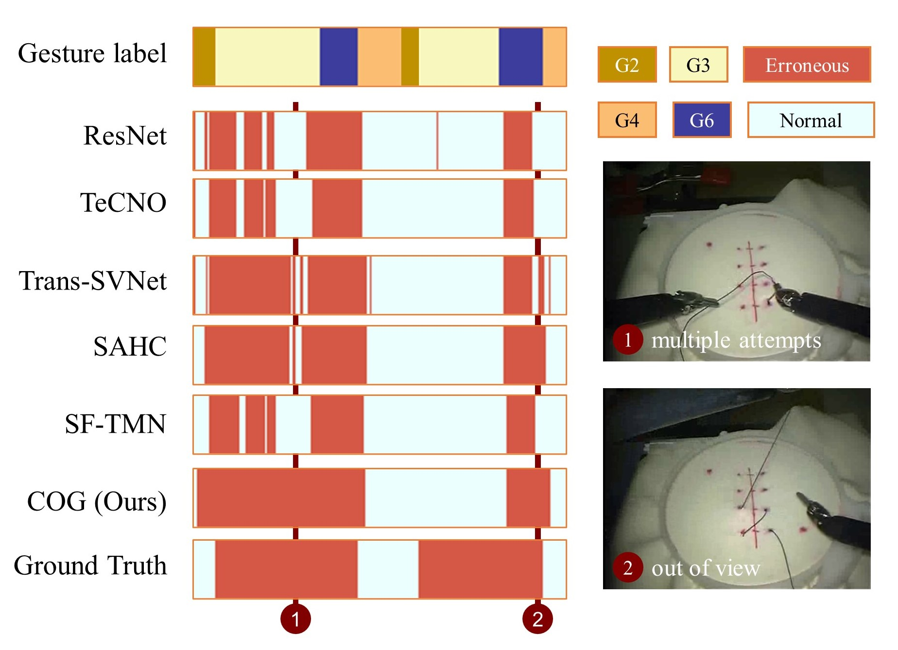

<h2 align="center">Think Step by Step: Chain-of-Gesture Prompting for  Error Detection in Robotic Surgical Videos</h2>

Official implementation of [[COG arxiv](https://arxiv.org/abs/2406.19217)] [[IEEE link](https://ieeexplore.ieee.org/document/10750058)]

## Motivation

Previous methods detect errors with two separate parts: gesture recognition and error detection for each type of gesture. We propose an end-to-end Chain-of-Gesture prompting framework to capture complex visual reasoning processes with two reasoning modules: Gestural-Visual reasoning and Multi-scale Temporal Reasoning.


## Architecture



## Citation
If the paper and code from COG help your research, we kindly ask you to give a citation to our paper ❤️. Additionally, if you appreciate our work and find this repository useful, giving it a star ⭐️ would be a wonderful way to support our work. Thank you very much.
```bibtex
@ARTICLE{10750058,
  author={Shao, Zhimin and Xu, Jialang and Stoyanov, Danail and Mazomenos, Evangelos B. and Jin, Yueming},
  journal={IEEE Robotics and Automation Letters}, 
  title={Think Step by Step: Chain-of-Gesture Prompting for Error Detection in Robotic Surgical Videos}, 
  year={2024},
  volume={9},
  number={12},
  pages={11513-11520},
  keywords={Videos;Surgery;Cognition;Real-time systems;Transformers;Visualization;Kinematics;Training;Semantics;Robot kinematics;Medical robotics;Computer vision for medical robotics;surgical error detection;video-language learning;prompt engineering},
  doi={10.1109/LRA.2024.3495452}}
```

## Table of Contents

- [Table of Contents](#table-of-contents)
- [Get Started](#get-started)
  - [Installation](#installation)
- [Training](#training)
  - [Datasets](#datasets)
  - [Training Commands](#train-the-model)
  - [Prediction postprocessing](#prediction-postprocessing)
  - [Ablation Study](#ablation-study)
- [Results]()
  - [Comparison](#Comparison with other methods and ablation of each module)
  - [Visualization](#visualization)

## Get Started

### Installation

1. Clone COG.
```bash
git clone --recursive https://github.com/jinlab-imvr/Chain-of-Gesture
cd Chain-of-Gesture
```

2. Create the environment, here we show an example using conda.

```bash
conda env create -f environment.yml
conda activate sed
## Some packages might be deprecated or fail to install automatically. If that happens, you can manually install them with pip.
pip install git+https://github.com/openai/CLIP.git
## If you encounter issues installing CLIP, refer to the official CLIP repository (https://github.com/openai/CLIP) for troubleshooting and installation guidance.
```

## Training

In this section, we present a short demonstration to get started with training COG.

### Datasets
### Download and prepare the dataset
We download the original data and extended error labels according to [Kay Hutchinson et al.](https://github.com/UVA-DSA/ExecProc_Error_Analysis). 
All data under leave-one-user-out setting are in the [LOSO folder](./dataset/setting_f1/LOSO).

### Train the model
```bash
python train_COG.py -exp COG -t 4 -l 1e-4 -gpu_id cuda:0
```

### Prediction postprocessing
Besides results at frame level, to ensure an explicit and fair comparison with the state-of-the-art work on [surgical error detection](https://ieeexplore.ieee.org/stamp/stamp.jsp?arnumber=9812034), we follow its evaluation protocol to generate window-level metrics. Specifically, we apply a 2-second sliding window with a 1.2second stride to the frame-level predictive labels. Within each window, we average the predictions and binarize them using a threshold of 0.5 to generate the window-level predictive labels.

### Ablation study

You can run some ablation studies in [ablation_hyp.sh](./ablation_hyp.sh) to find better hyperparameters and find each module like MSTR, GVR in [models.py](models.py).

## Results

### Comparison with other methods and ablation of each module 


### Visualization



